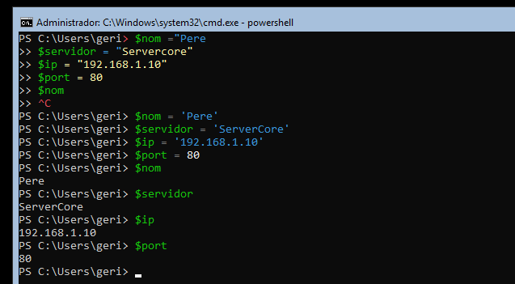
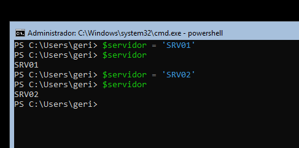
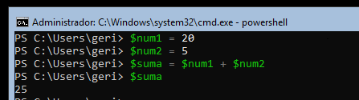
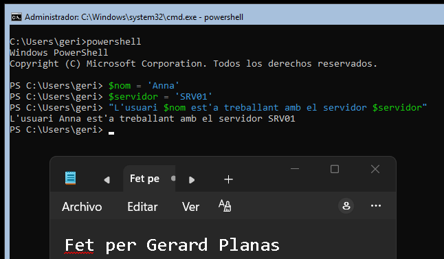
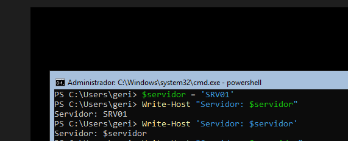
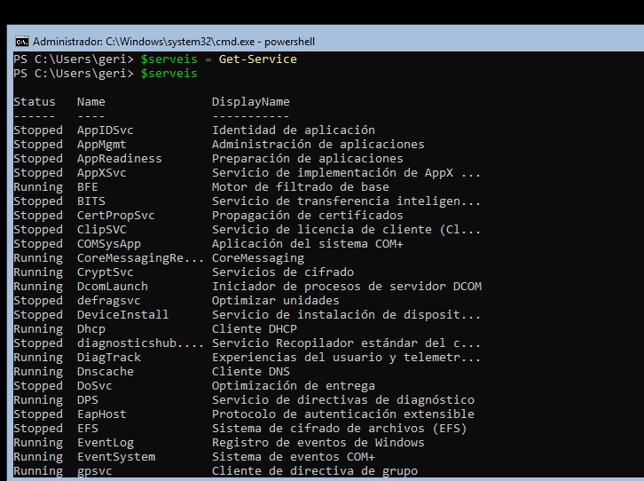
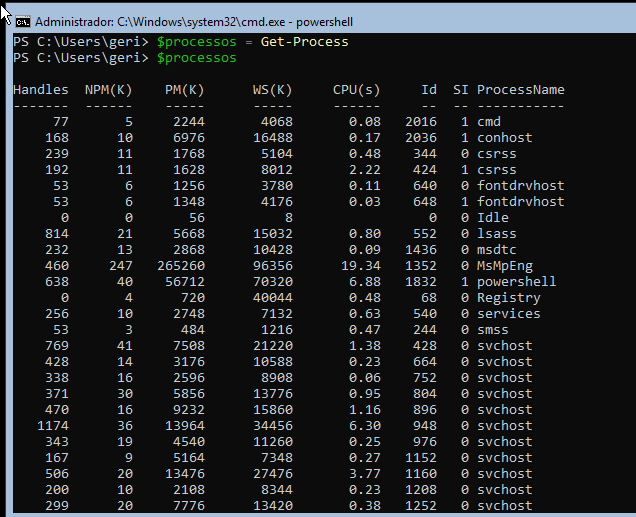
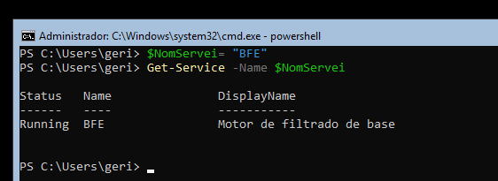

> **Nota**: Els exercicis/pràctiques t'han de servir per a familiarizar-te amb el llenguatge Powershell. Aprofita per a realitzar diverses proves i veure què passa. Documenta també aquestes proves i resultats.
# Treballar amb variables

## 1. Crear variables

Crea les variables següents:

```
$nom
$servidor
$ip
$port
```

Assigna-hi valors.

Per exemple:

```
$nom = "Pere"
```

Mostra després el contingut de cadascuna de les variables.

---

## 2. Modificar una variable

Crea:

```
$servidor = "SRV01"
```

Mostra el seu valor.

Després canvia'l per:

```
SRV02
```

Comprova quin valor conserva la variable.


---

## 3. Operacions

Crea dues variables:

```
$num1 = 20
$num2 = 5
```

Crea una tercera variable que guardi:

- la suma;
- la resta;
- la multiplicació;
- la divisió.

Per exemple:

```
$resultat = $num1 + $num2
```

Mostra cada resultat.

---

## 4. Variables dins d'un text

Crea:

```
$nom = "Anna"
$servidor = "SRV01"
```

Intenta obtenir aquesta sortida:

```
L'usuari Anna està treballant amb el servidor SRV01
```

utilitzant les variables dins del text.


---

## 5. Cometes

Executa:

```
$servidor = "SRV01"
```

Després:

```
Write-Host "Servidor: $servidor"
```

i:

```
Write-Host 'Servidor: $servidor'
```


Respon:

**Quina diferència observes? Per què creus que passa?**

    Amb cometes dobles (" ") PowerShell substitueix la variable pel seu valor. 
    Amb cometes simples (' ') PowerShell mostra el text tal com està escrit i no substitueix 
    la variable.
---

## 6. Guardar el resultat d'una ordre

Executa:

```
$serveis = Get-Service
```

Després:

```
$serveis
```


Respon:

- Què creus que conté $serveis?

    Conté els serveis de Windows

- La variable conté un únic valor o diversos elements?

    Conté diversos elements, un per a cada servei.

Fes el mateix amb:

```
$processos = Get-Process
```

i comprova el seu contingut.


    Veiem una llista de processos que s'estan executant
---

## 7. Aplicació a administració

Crea una variable:

```
$nomServei = "Spooler"
```

Utilitza aquesta variable per consultar el servei amb:

```
Get-Service -Name ...
```

L'objectiu és obtenir el mateix resultat que:

```
Get-Service -Name Spooler
```

però **sense escriure `Spooler` directament en el cmdlet**.


    Utilitzem aquesta variable per guardar el nom d'una consultar a una variable.