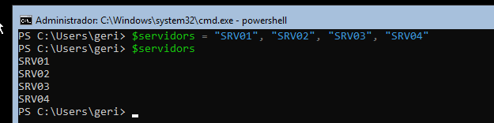
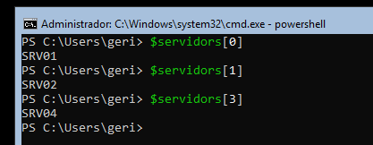
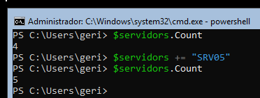
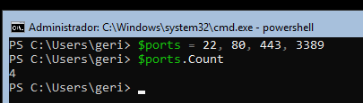
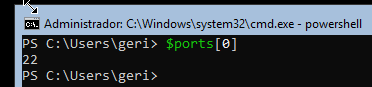
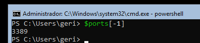
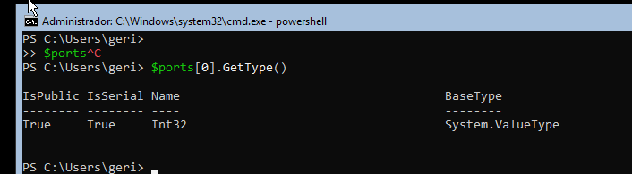
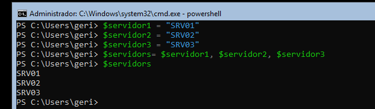

> **Nota**: Els exercicis/pràctiques t'han de servir per a familiarizar-te amb el llenguatge Powershell. Aprofita per a realitzar diverses proves i veure què passa. Documenta també aquestes proves i resultats.

# Arrays

## 1. Crear un array

Crea un array amb aquests servidors:
```text
SRV01
SRV02
SRV03
SRV04
```
Guarda'l dins de:
```powershell
$servidors
```


Mostra tot el contingut de l'array.




## 2. Accedir a posicions
Amb l'array anterior, mostra:

- el primer servidor;
- el segon servidor;
- el quart servidor.



Respon:

**Quina és la posició del primer element d'un array?**
La posició **0**. Els arrays de PowerShell comencen a comptar des de 0, així que el primer element és `$servidors[0]`.
## 3. Comptar elements
Utilitza:
```powershell
.Count
```
per saber quants servidors hi ha dins de l'array.

Afegeix:
```
SRV05
```
i torna a comprovar el nombre d'elements.



**Observació:** `.Count` mostra 4 elements. Amb `+=` afegeixo `SRV05` al final i ara en mostra 5.

## 4. Modificar un element

Partint de:
```powershell
$servidors = "SRV01", "SRV02", "SRV03"
```
modifica el segon element perquè passi a ser:
```text
SRV-WEB01
```
Mostra després tot l'array.


**Observació:** el segon element és a la posició `[1]`. Amb `$servidors[1] = "SRV-WEB01"` el substitueixo i, en mostrar l'array, `SRV02` ha passat a ser `SRV-WEB01`.
## 5. Array de ports

Crea un array numèric amb els següents ports: 22, 80, 443 i 3389

Respon (i digues quina comanda has executat per obtenir la resposta):

- Quants ports hi ha?



**Observació:** hi ha 4 ports. `.Count` retorna el nombre d'elements.


- Quin és el primer?



**Observació:** el primer element és a la posició `[0]` i val 22.

- Quin és l'últim?



**Observació:** l'índex `[-1]` dona l'últim element, que és 3389.

- Quin tipus té el primer element?


**Observació:** el primer element és `Int32`, un número enter, perquè s'ha escrit sense cometes.
## 6. Array i variables

Crea:
```powershell
$servidor1 = "SRV01"
$servidor2 = "SRV02"
$servidor3 = "SRV03"
```
Després crea un array a partir d'aquestes variables:

Mostra'n el contingut.



**Observació:** he creat l'array separant les tres variables amb comes. L'array guarda els valors de les variables (`SRV01`, `SRV02`, `SRV03`) i en mostrar-lo surt un element per línia.

## 7. Resultats d'un cmdlet

Utilitza un array per a determinar el número de processos que s'estan executant en el sistema.
## 8. General

Crea un array:
```powershell
$servidors = "SRV-DC01", "SRV-DNS01", "SRV-WEB01", "SRV-FILES01"
```
Sense tornar a escriure els noms dels servidors manualment, mostra una sortida semblant a:
```text
Primer servidor: SRV-DC01
Últim servidor: SRV-FILES01
Nombre de servidors: 4
```
